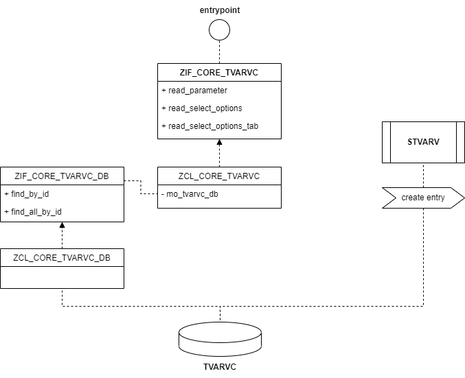

# abap-tvarvc
A TVARVC helper class that makes easy and unique the process of selecting configuration data from database.

- traceability
- straightforward approach
- easy to use

## Diagram

<p align="center">

</p>

## Instantiating

- create an pair value entry on `STVARV`;
- create a variable containing the key name;
- use snippet below to instantiate the `TVARVC Helper`.

```abap
DATA go_tvarvc TYPE REF TO zif_core_tvarvc.
DATA gx_tvarvc TYPE REF TO zcx_core_tvarvc.

CONSTANTS gc_tvarvc_entry TYPE string VALUE 'Z_TEST_TVARVC_SELECT_OPTIONS'.

CREATE OBJECT go_tvarvc TYPE zcl_core_tvarvc.

TRY.
    gt_tvarvc = go_tvarvc->read_select_options( gc_tvarvc_entry ).

  CATCH zcx_core_tvarvc INTO gx_tvarvc.
    gx_tvarvc->raise_message( ).
ENDTRY.
```

## Examples and documentation

Main class is `ZCL_CORE_TVARVC`.

Find methods of `TVARVC Helper` below aside of its documentation. 

- [**read_parameter**](#read-parameter)
- [**read_select_options**](#read_select_options)
- [**read_select_options_tab**](#read_select_options_tab)

### read_parameter

Read a single parameter. Value is returned into a flat structure type of `rsparam_tt`.

- _input_: 
  - iv_name _TYPE (string)_
- _result_: TYPE rsparam

Example: `Z_TEST_TVARVC_PARAMETER`. 

See source code [**here**](src/z_test_tvarvc_parameter.prog.abap).

#

### read_select_options

Read a single parameter with values splitted by a separator. Values are returned into a internal table type of `rsparam_tt`.  

- _input_: 
  - iv_name _TYPE (string)_
  - iv_separator _TYPE (string)_
- _result_: TYPE rsparam_tt

Example: `Z_TEST_TVARVC_SELECT_OPTIONS`. 

See source code [**here**](src/z_test_tvarvc_select_options.prog.abap).

#

### read_select_options_tab

Read a select options values. Values are returned into a internal table type of `rsparam_tt`.

- _input_: 
  - iv_name _TYPE (string)_
- _result_: TYPE rsparam_tt

Example: `Z_TEST_TVARVC_SELECT_OPTIONS_T`. 

See source code [**here**](src/z_test_tvarvc_select_options_t.prog.abap).
